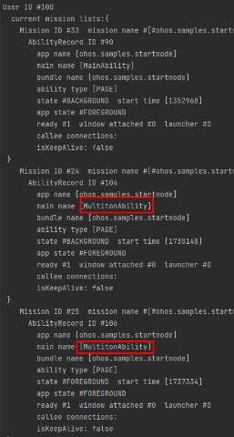
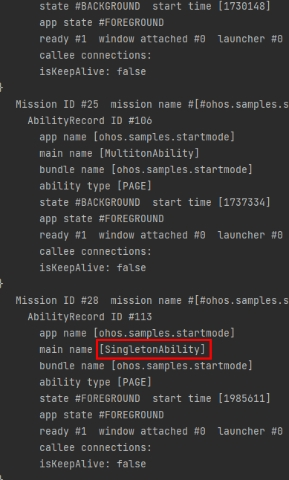
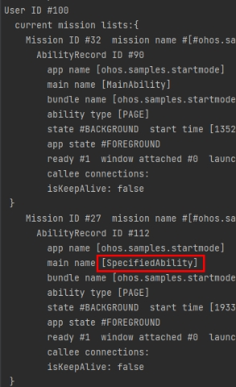

# UIAbility的启动模式

### 介绍

本示例展示了在一个Stage模型中，实现multiton、singleton、specified多种模式场景。

本实例参考开发指南。
本实例需要使用aa工具(hdc shell执行后，执行aa dump -a命令即可)查看应用Ability模式信息。

### 效果预览

|主页| 普通多实例Ability信息                                                 |单实例Ability信息|指定多实例Ability信息|
|--------------------------------|----------------------------------------------------------------|--------------------------------|--------------------------------|
||  |||

使用说明

1、multiton模式：

1）进入首页，点击番茄，会新建一个番茄的Ability，展示番茄的详情；

2）在番茄的详情界面，点击黄瓜，会新建一个黄瓜的Ability，展示黄瓜的详情；

3）使用aa工具查看Ability信息，此时存在以下Ability：1个番茄的Ability、1个黄瓜的Ability、1个首页的Ability；

2、singleton模式：

1）进入首页，点击冰淇凌，会新建一个冰淇凌的Ability，展示冰淇凌的详情；

2）在冰淇凌的详情界面，点击螃蟹，会复用冰淇凌的Ability，页面数据会刷新并展示螃蟹的详情；

3）使用aa工具查看Ability信息，此时存在以下Ability：1个冰淇凌的Ability、1个首页Ability；

3、specified模式：

1）进入首页，点击核桃，会新建一个核桃的Ability，展示核桃的详情；

2）在核桃的详情界面，点击蓝莓，会新建一个蓝莓的Ability，展示蓝莓的详情；

3）在蓝莓的详情界面，点击核桃，会复用已存在的核桃的Ability，实现specified模式下的单实例特性，页面数据会刷新并展示核桃的详情；

4）使用aa工具查看Ability信息，此时存在以下Ability：1个核桃的Ability、1个蓝莓的Ability、1个首页Ability；

### 工程目录
```
├──entry/src/main/ets/
│  ├──application
│  │  └──MyAbilityStage.ets 
│  ├──common
│  │  ├──Logger.ts                        // 日志工具
│  │  └──Util.ets                         // 封装常用函数
│  ├──mainability
│  │  └──MainAbility.ets 
│  ├──model
│  │  ├──DataModels.ets                   // 封装数据类型
│  │  ├──DataUtil.ets                     // 封装数据处理函数
│  │  └──MokeData.ets                     // 模拟数据
│  ├──pages
│  │  ├──component
│  │  │  └──FoodListItem.ets              // 食物列表组件
│  │  ├──FoodDetail.ets                   // 食物详情页
│  │  └──Home.ets                         // 首页
│  ├──singletonability                  
│  │  └──SingletonAbility.ets             // singleton模式的Ability
│  ├──specifiedability                  
│  │  └──SpecifiedAbility.ets             // specified模式的Ability
│  └──MultitonAbility                  
│     └──MultitonAbility.ets              // multiton模式的Ability
└──entry/src/main/resource                // 应用静态资源目录
```
### 具体实现

* 本示例启动multiton、singleton、specified三种模式的方法主要封装在Util当中，源码参考:[Util.ets](entry/src/main/ets/common/Util.ets) 。
  * 新建Ability：创建三个代表multiton、singleton、specified模式的Ability，如工程目录中的SingletonAbility、SpecifiedAbility、MultitonAbility，并在module.json文件中将launchType属性修改为对应的启动模式属性。
  * 启动指定Ability：通过Util中的startMode函数根据页面所传的abilityName，启动对应的ability并进入详情页面。
  * specified多实例功能实现：specified模式则是根据MyAbilityStage中的onAcceptWant函数给用户返回一个ability标识，如果之前启动过标识的ability，不创建新的实例并拉回栈顶，否则创建新的实例并启动。

### 相关权限

不涉及。

### 依赖

不涉及。

### 约束与限制

1.本示例仅支持标准系统上运行，支持设备：华为手机。

2.HarmonyOS系统：HarmonyOS NEXT Developer Preview1及以上。

3.DevEco Studio版本：DevEco Studio NEXT Developer Preview1及以上。

4.HarmonyOS SDK版本：HarmonyOS NEXT Developer Preview1 SDK及以上。